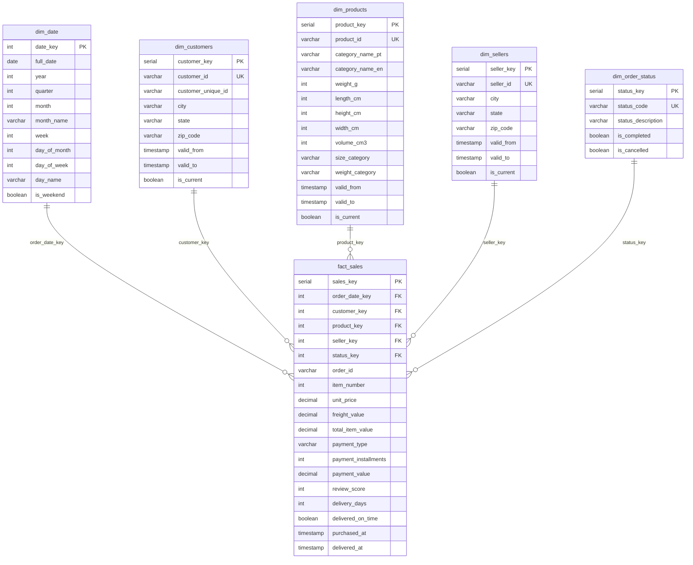

# Star Schema ER Diagram

Star Schema Characteristics
Design Pattern: STAR SCHEMA

1 Central Fact Table (fact_sales) - contains measurements/metrics
5 Dimension Tables (surrounding) - contains descriptive attributes
Optimized for Analytics - fast aggregations, simple joins

Fact Table: fact_sales
Grain: One row per order item

Keys: 5 foreign keys linking to dimensions
Measures: Numeric facts (price, freight, payment, delivery days)
Degenerate Dimensions: order_id, item_number stored in fact

Dimension Tables
DimensionTypeSCDPurposedim_dateConformedNoTime-based analysisdim_customersType 2YesCustomer attributes & historydim_productsType 2YesProduct catalog & categorizationdim_sellersType 2YesSeller information & locationdim_order_statusType 1NoOrder status lookup
Key Features
✅ Surrogate Keys: SERIAL primary keys (customer_key, product_key, etc.)

Protects from source system changes
Enables SCD Type 2 tracking
Improves join performance

✅ Slowly Changing Dimensions (SCD Type 2):

valid_from / valid_to timestamps
is_current flag
Tracks historical changes

✅ Derived Attributes:

size_category (Small/Medium/Large)
weight_category (Light/Medium/Heavy)
volume_cm3 (calculated dimension)
Business-friendly categorizations

✅ Performance Optimization:

Indexes on all foreign keys
Indexes on frequently filtered columns
Optimized for SELECT queries

Sample Analytical Query
sql-- Monthly revenue by product category
SELECT 
    d.year,
    d.month_name,
    p.category_name_en,
    COUNT(DISTINCT f.order_id) as orders,
    SUM(f.total_item_value) as revenue
FROM fact_sales f
JOIN dim_date d ON f.order_date_key = d.date_key
JOIN dim_products p ON f.product_key = p.product_key
WHERE d.year = 2018
GROUP BY d.year, d.month, d.month_name, p.category_name_en
ORDER BY d.month, revenue DESC;
Why This Works Well:

Simple 2-table joins (fact + 2 dimensions)
Fast execution due to indexes
Easy to understand for business users
Flexible for different time periods/categories

Benefits of This Design
BenefitDescriptionQuery PerformanceStar schema optimized for aggregationsSimplicityEasy to understand, one hop from fact to dimensionFlexibilityAdd dimensions without changing fact tableScalabilityCan handle millions of fact recordsBusiness-FriendlyDimension names match business languageHistorical TrackingSCD Type 2 preserves history