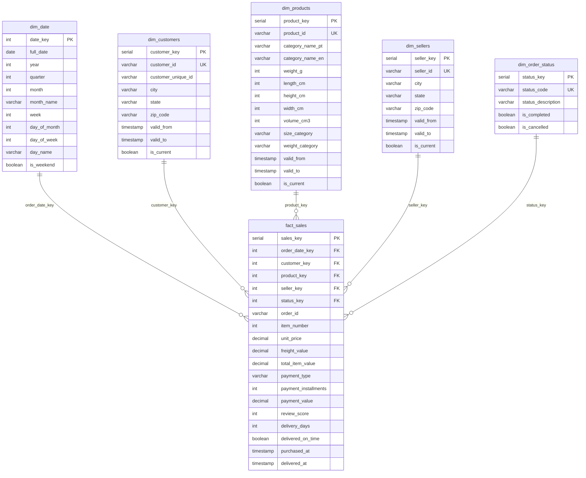

# Star Schema ER Diagram


# ⭐ Star Schema Design Pattern — Data Warehouse Model

## Overview

This project implements a **Star Schema** data warehouse design optimized for analytical querying and business intelligence reporting.

The schema consists of:

* **1 Central Fact Table:** `fact_sales`
* **5 Surrounding Dimension Tables**
* Optimized for **analytics, aggregation, and reporting**

The goal of the design is to provide **fast queries, simple joins, and historical tracking**.

---

## Star Schema Structure

### Central Fact Table

**Table:** `fact_sales`
**Grain:** One row per **order item**

### Keys

The fact table contains **5 foreign keys** linking to dimensions:

* `date_key`
* `customer_key`
* `product_key`
* `seller_key`
* `order_status_key`

### Measures (Facts)

Numeric measurements stored in the fact table:

* item_price
* freight_value
* payment_value
* delivery_days
* total_item_value

### Degenerate Dimensions

Stored directly in the fact table (no separate dimension table):

* `order_id`
* `item_number`

---

## Dimension Tables

| Dimension        | Type            | SCD    | Purpose                          |
| ---------------- | --------------- | ------ | -------------------------------- |
| dim_date         | Conformed       | No     | Time-based analysis              |
| dim_customers    | Slowly Changing | Type 2 | Customer attributes & history    |
| dim_products     | Slowly Changing | Type 2 | Product catalog & categorization |
| dim_sellers      | Slowly Changing | Type 2 | Seller information & location    |
| dim_order_status | Lookup          | Type 1 | Order status reference           |

---

## Key Design Features

### 1️ Surrogate Keys

Each dimension uses a surrogate primary key:

* `customer_key`
* `product_key`
* `seller_key`
* `date_key`
* `order_status_key`

**Benefits**

* Protects from source system ID changes
* Enables SCD Type 2 tracking
* Improves join performance

---

### 2️ Slowly Changing Dimensions (SCD Type 2)

Historical changes are preserved using:

* `valid_from`
* `valid_to`
* `is_current`

This allows the warehouse to track historical attribute changes such as:

* customer location changes
* product category updates
* seller information changes

---

### 3️ Derived Attributes

Business-friendly derived fields are created:

* `size_category` (Small / Medium / Large)
* `weight_category` (Light / Medium / Heavy)
* `volume_cm3` (calculated attribute)

These simplify business analysis and reporting.

---

### 4️ Performance Optimization

To improve query performance:

* Indexes on all foreign keys
* Indexes on commonly filtered columns
* Optimized for **SELECT analytical queries**
* Reduced join complexity

---

## Sample Analytical Query

### Monthly Revenue by Product Category

```sql
SELECT 
    d.year,
    d.month_name,
    p.category_name_en,
    COUNT(DISTINCT f.order_id) AS orders,
    SUM(f.total_item_value) AS revenue
FROM fact_sales f
JOIN dim_date d 
    ON f.order_date_key = d.date_key
JOIN dim_products p 
    ON f.product_key = p.product_key
WHERE d.year = 2018
GROUP BY d.year, d.month, d.month_name, p.category_name_en
ORDER BY d.month, revenue DESC;
```

---

## Why This Design Works

* Simple joins (fact + dimensions)
* Fast aggregations using indexes
* Easy for business users to understand
* Flexible analysis across different time periods and categories

---

## Benefits of the Star Schema

| Benefit             | Description                                                  |
| ------------------- | ------------------------------------------------------------ |
| Query Performance   | Optimized for aggregations and BI dashboards                 |
| Simplicity          | One-hop joins from fact to dimension                         |
| Flexibility         | New dimensions can be added without modifying the fact table |
| Scalability         | Handles millions of fact records efficiently                 |
| Business-Friendly   | Dimension names match business terminology                   |
| Historical Tracking | SCD Type 2 preserves history                                 |

---

## Conclusion

The implemented **Star Schema** provides a scalable and high-performance analytical data warehouse.
It supports historical tracking, business reporting, and complex analytical queries while remaining simple and maintainable.
